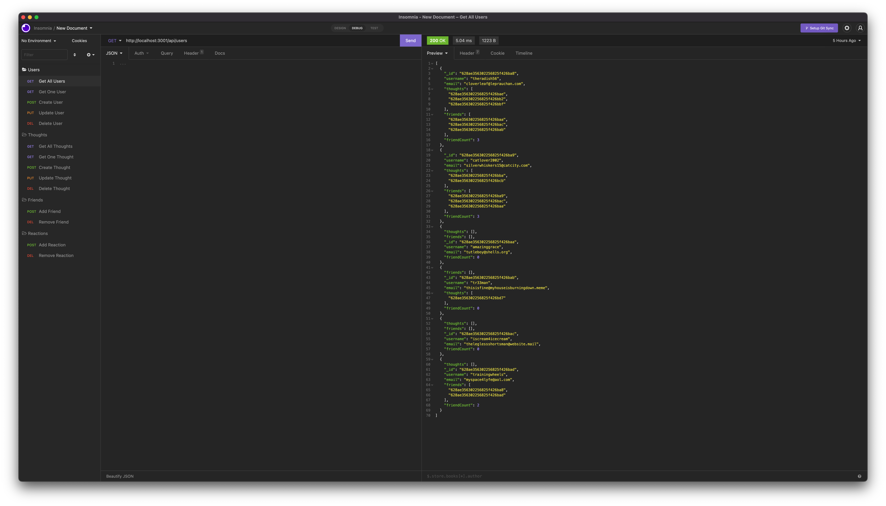

# Social Network API &nbsp; 
    
## Description

This Social Network API uses MongoDB to build the foundation for NoSQL social network. Out of the box, users are able to share thoughts, react to thoughts, and connect with friends.

<br>

## Video Walkthrough


<br>

## Screenshot



<br>

## Table of Contents

* [Installation](#installation)
* [Usage](#usage)
   - [Start Guide](#usage)
   - [User Routes](#user-routes)
   - [Friend Routes](#friend-routes)
   - [Thought Routes](#thought-routes)
   - [Reaction Routes](#reaction-routes)
* [License](#license)
* [Contributing](#contributing)
* [Tests](#tests)
* [Questions](#questions)

<br>

## Installation

This project requires the installation of [Node.js](https://nodejs.org/), [npm express](https://www.npmjs.com/package/express), and [npm Mongoose](https://www.npmjs.com/package/mongoose) before use.

<br>
<br>

# Usage

The Social Network API is designed to be started with a command line and used with an API client.

In our examples, we'll be using [Insomnia](https://insomnia.rest).

<br>

### Start the Server
---
From a command line, navigate to this directory then run "node index.js".

   * This should start the server.
   * If successful, you'll see this confirmation message in the terminal:

         Social Network API server running on port 3001!

   * If you're running the server on a different port, the number will change accordingly.

<br>
<br>

## User Routes

<br>

### Create a User
---
Test the following `POST` route with Insomnia:

      /api/users

<br>

The API will expect the request body to include a new `username` and `email` address.

```json
   // example
   {
      "username": "theradish",
      "email": "radishfan@gmail.com"
   }
```

<br>

### Get All Users
---
Test the following `GET` route with Insomnia:

      /api/users

<br>

The API will respond with data for every user, in a formatted JSON.

```json
   // example
   [
      {
         "_id": "628ae356302256825f426ba8",
         "username": "theradish56",
         "email": "cloverleaf@leprauchan.com",
         "thoughts": [
            "628ae356302256825f426bae",
            "628ae356302256825f426bb2",
            "628ae356302256825f426bbf"
         ],
         "friends": [
            "628ae356302256825f426baa",
            "628ae356302256825f426bac",
            "628ae356302256825f426bab"
         ],
         "friendCount": 3
      },
      {
		"thoughts": [],
		"_id": "628ae356302256825f426bad",
		"username": "trainingwheels",
		"email": "myspace4lyfe@aol.com",
		"friends": [
			"628ae356302256825f426ba8",
			"628ae356302256825f426bad"
		],
		"friendCount": 2
	}
   ]
```

<br>

### Get a Single User
---
Test the following `GET` route with Insomnia:

      /api/users/<User ID>

<br>

The API will respond with data for only the selected user, in a formatted JSON.

```json
   // example  /api/users/628ae356302256825f426ba8
   [
      {
         "_id": "628ae356302256825f426ba8",
         "username": "theradish56",
         "email": "cloverleaf@leprauchan.com",
         "thoughts": [
            "628ae356302256825f426bae",
            "628ae356302256825f426bb2",
            "628ae356302256825f426bbf"
         ],
         "friends": [
            "628ae356302256825f426baa",
            "628ae356302256825f426bac",
            "628ae356302256825f426bab"
         ],
         "friendCount": 3
      }
   ]
```

<br>

### Update a User
---
Test the following `PUT` route with Insomnia:

      /api/users/<User ID>

<br>

The API will expect the request body to include an updated username OR email address OR both.

```json
   // example
   {
      "username": "theradishwizard",
      "email": "radishfan@gmail.com"
   }
```

<br>

### Delete a User
---
Test the following `DELETE` route with Insomnia:

      /api/users/<User ID>

<br>

If successful, you'll see this confirmation message:

      User and associated thoughts deleted!

<br>
<br>

## Friend Routes

<br>

### Add a Friend
---
In order to add a friend to a user, both users must already exist in the database.

Test the following `POST` route with Insomnia:

      /api/users/<User ID>/friends/<Friend ID>

<br>

The API will respond with data for the selected user, in a formatted JSON.

You should now see the friend's user ID listed under "friends."

```json
   // example  /api/users/628ae356302256825f426ba8/friends/628ae356302256825f426bab
   [
      {
         "_id": "628ae356302256825f426ba8",
         "username": "theradishwizard",
         "email": "cloverleaf@leprauchan.com",
         "thoughts": [
            "628ae356302256825f426bae",
            "628ae356302256825f426bb2",
            "628ae356302256825f426bbf"
         ],
         "friends": [
            "628ae356302256825f426baa",
            "628ae356302256825f426bac",
            "628ae356302256825f426bab"
         ],
         "friendCount": 3
      }
   ]
```

<br>

### Remove a Friend
---
Test the following `DELETE` route with Insomnia:

      /api/users/<User ID>/friends/<Friend ID>

<br>

The API will respond with data for the selected user, in a formatted JSON.

You should now see the friend's user ID removed from the "friends" list.

```json
   // example  /api/users/628ae356302256825f426ba8/friends/628ae356302256825f426bab
   [
      {
         "_id": "628ae356302256825f426ba8",
         "username": "theradishwizard",
         "email": "cloverleaf@leprauchan.com",
         "thoughts": [
            "628ae356302256825f426bae",
            "628ae356302256825f426bb2",
            "628ae356302256825f426bbf"
         ],
         "friends": [
            "628ae356302256825f426baa",
            "628ae356302256825f426bac"
         ],
         "friendCount": 3
      }
   ]
```

<br>
<br>

## Thought Routes

<br>

### Create a Thought
---
Test the following `POST` route with Insomnia:

      /api/thoughts

<br>

The API will expect the request body to include `thoughtText` and `username`.

```json
   // example
   {
      "thoughtText": "If seagulls flew over the bay, they would be called bagels",
      "username": "theradishwizard"
   }
```

<br>

### Get All Thoughts
---
Test the following `GET` route with Insomnia:

      /api/thoughts

<br>

The API will respond with data for every thought, in a formatted JSON.

```json
   // example
   [
      {
         "_id": "628ae356302256825f426bae",
         "thoughtText": "If seagulls flew over the bay, they would be called bagels",
         "username": "theradishwizard",
         "reactions": [
            {
               "reactionBody": "like",
               "username": "trainingwheels",
               "_id": "628ae356302256825f426baf",
               "createdAt": "2022-05-23T01:28:54.783Z"
            }
         ],
         "createdAt": "2022-05-23T01:28:54.783Z",
         "__v": 0,
         "reactionCount": 1
      },
      {
         "_id": "628ae356302256825f426bba",
         "thoughtText": "Dear Math, grow up and solve your own problems.",
         "username": "catlover2002",
         "reactions": [
            {
               "reactionBody": "cool",
               "username": "trainingwheels",
               "_id": "628ae356302256825f426bbb",
               "createdAt": "2022-05-23T01:28:54.805Z"
            },
            {
               "reactionBody": "awesome",
               "username": "catlover2002",
               "_id": "628ae356302256825f426bbc",
               "createdAt": "2022-05-23T01:28:54.805Z"
            }
         ],
         "createdAt": "2022-05-23T01:28:54.805Z",
         "__v": 0,
         "reactionCount": 2
	   }
   ]
```

<br>

### Get a Single Thought
---
Test the following `GET` route with Insomnia:

      /api/thoughts/<Thought ID>

<br>

The API will respond with data for only the selected thought, in a formatted JSON.

```json
   // example  /api/thoughts/628ae356302256825f426bae
   [
      {
         "_id": "628ae356302256825f426bae",
         "thoughtText": "If seagulls flew over the bay, they would be called bagels",
         "username": "theradish56",
         "reactions": [
            {
               "reactionBody": "like",
               "username": "trainingwheels",
               "_id": "628ae356302256825f426baf",
               "createdAt": "2022-05-23T01:28:54.783Z"
            }
         ],
         "createdAt": "2022-05-23T01:28:54.783Z",
         "__v": 0,
         "reactionCount": 1
      },
   ]
```

<br>

### Update a Thought
---
Test the following `PUT` route with Insomnia:

      /api/users/<Thought ID>

<br>

The API will expect the request body to include an updated `thoughtText`.

```json
   // example  /api/thoughts/628ae356302256825f426bae
   {
      "thoughtText": "Why do seagulls fly over the ocean? Because if they flew over the bay, we'd call them bagels."
   }
```

<br>

### Delete a Thought
---
Test the following `DELETE` route with Insomnia:

      /api/users/<Thought ID>

```json
   // example  /api/thoughts/628ae356302256825f426bae
```

<br>

If successful, you'll see this confirmation message:

      Thought successfully deleted!

<br>
<br>

## Reaction Routes

<br>

### Add a Reaction
---
Test the following `POST` route with Insomnia:

      /api/thoughts/<Thought ID>/reactions

<br>

The API will expect the request body to include `reactionBody` and `username`.

```json
   // example  /api/thoughts/628ae356302256825f426bae/reactions
   {
      "reactionBody": "love this",
      "username": "trainingwheels"
   }
```

<br>

The API will respond with data for the selected thought, in a formatted JSON.

You should now see the new reaction listed under "reactions."

```json
   // example  /api/thoughts/628ae356302256825f426bae/reactions
   [
      {
         "_id": "628ae356302256825f426bae",
         "thoughtText": "If seagulls flew over the bay, they would be called bagels",
         "username": "theradish56",
         "reactions": [
            {
               "reactionBody": "love this",
               "username": "trainingwheels",
               "_id": "628ae356302256825f426baf",
               "createdAt": "2022-05-23T01:28:54.783Z"
            }
         ],
         "createdAt": "2022-05-23T01:28:54.783Z",
         "__v": 0,
         "reactionCount": 1
      },
   ]
```

<br>

### Remove a Reaction
---
Test the following `DELETE` route with Insomnia:

      /api/users/<Thought ID>/reactions/<Reaction ID>

<br>

The API will respond with data for the selected thought, in a formatted JSON.

You should now see the reaction removed from the "reactions" list.

```json
   // example  /api/thoughts/628ae356302256825f426bae/reactions/628ae356302256825f426baf
   [
      {
         "_id": "628ae356302256825f426bae",
         "thoughtText": "If seagulls flew over the bay, they would be called bagels",
         "username": "theradish56",
         "reactions": [],
         "createdAt": "2022-05-23T01:28:54.783Z",
         "__v": 0,
         "reactionCount": 1
      },
   ]
```

<br>
<br>

---

<br>

## License

MIT License

Copyright &copy; 2022 Social Network API

<br>

## Contributing

* Node.js
* npm express
* npm Mongoose
* Insomnia

<br>

## Tests

Each route was tested using insomnia, as can be seen in the walkthrough video.

<br>

---

<br>

## Questions

[mreliwood on GitHub](https://github.com/mreliwood) &nbsp; | &nbsp; [contact.eliwood@gmail.com](mailto:contact.eliwood@gmail.com)